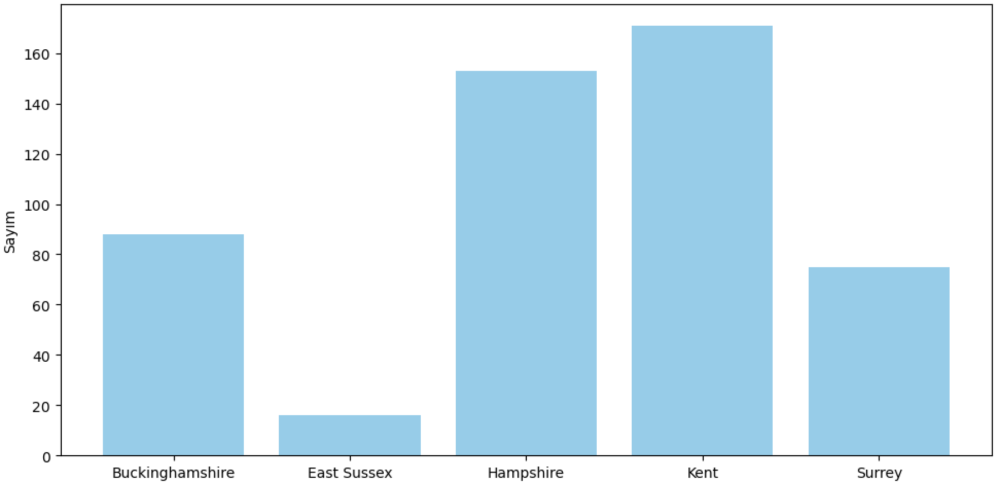

## UK Gov Job Listings Data Analysis Project

# Requirements
To run this project, following tools are required.

- pandas
- matplotlib
- numpy
- scikit-learn

To install requirements:

```
pip install pandas numpy matplotlib scikit-learn
```


# Project

This project consists of three folders:
- modules
- dataset
- visualizations

## Modules

Modules consist of classes that contain functions designed to be reusable and flexible for different types of analyses. This folder represents where the background tasks are performed and contains the core code structures that accomplish these tasks.

### Example usage of module:
```ruby
from local_outlier import LocalOutlierDetection

outlier_detection = LocalOutlierDetection()
outlier_detection.set_neighbors(20)
df['column_name_to_remove_outliers'] = outlier_detection.remove_outliers(df, 'column_name_to_remove_outliers')['column_name_to_remove_outliers']

```
## Dataset

This folder contains the raw dataset where all the data analyses are coming from.

## Visualizations

This folder contains all the .ipynb files that contains the code that are made with the help of the modules and aims to visualize according to the needs.

### Example Visualization




